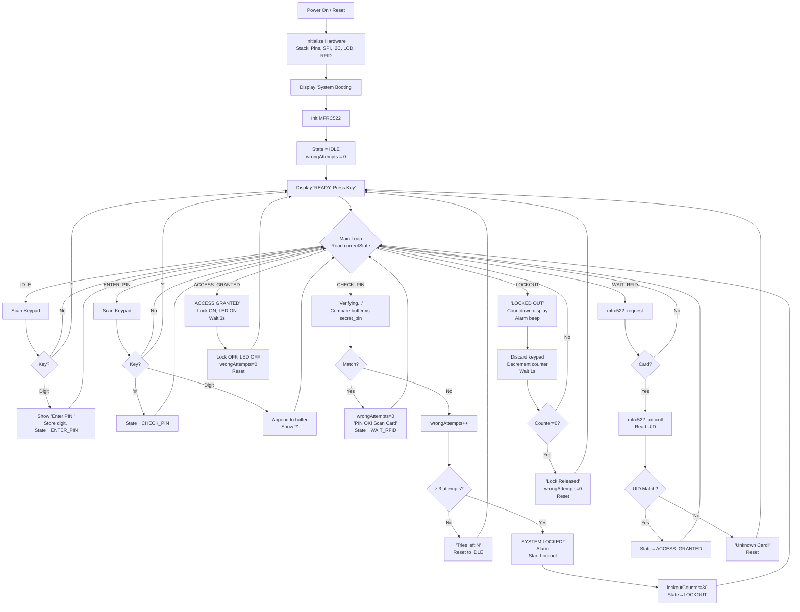

# EE322 Embedded Systems — Two-Factor Authentication Door Lock
## Project Presentation

> **Course:** EE 322 – Embedded Systems  
> **Platform:** Arduino Uno (ATmega328P @ 16 MHz)  
> **Language:** AVR Assembly (GNU AS `.S`) + Arduino C++ (Reference)

---

## Table of Contents

1. [Project Overview](#1-project-overview)
2. [Two-Factor Authentication Concept](#2-two-factor-authentication-concept)
3. [Hardware Architecture](#3-hardware-architecture)
4. [Pin Mapping](#4-pin-mapping)
5. [Software Architecture — Finite State Machine](#5-software-architecture--finite-state-machine)
6. [State Machine Flowchart](#6-state-machine-flowchart)
7. [Special Logic & Key Design Decisions](#7-special-logic--key-design-decisions)
8. [AVR Assembly Implementation Highlights](#8-avr-assembly-implementation-highlights)
9. [Hardware Drivers (Written from Scratch in ASM)](#9-hardware-drivers-written-from-scratch-in-asm)
10. [Security Features](#10-security-features)
11. [PCB / Final Hardware Variant](#11-pcb--final-hardware-variant)
12. [Memory Layout](#12-memory-layout)
13. [Build & Flash Instructions](#13-build--flash-instructions)
14. [Credentials & Customization](#14-credentials--customization)
15. [Repository Structure](#15-repository-structure)

---

## 1. Project Overview

This project implements a **Two-Factor Authentication (2FA) Door Lock** on a bare ATmega328P microcontroller.

**Two factors required to unlock:**
1. **Factor 1 — PIN Entry:** User types a 4-digit PIN on a 4×4 matrix keypad.
2. **Factor 2 — RFID Card Scan:** User presents a registered 13.56 MHz RFID card to the MFRC522 reader.

The door unlocks **only when both factors match** the stored credentials. The entire security logic — including keypad scanning, I2C LCD display, SPI RFID communication, and the state machine — is implemented in **bare-metal AVR assembly** without any library calls.

---

## 2. Two-Factor Authentication Concept

```
┌──────────────────────────────────────────────────────────────┐
│                AUTHENTICATION FLOW                           │
│                                                              │
│  [User at Door]                                              │
│       │                                                      │
│       ▼                                                      │
│  Enter 4-digit PIN on keypad ──── Wrong? ──→ Denied          │
│       │                                         (3x max)     │
│       ▼ Correct                                              │
│  Scan RFID Card ──────────────── Wrong? ──→ Denied           │
│       │                                                      │
│       ▼ Correct                                              │
│  🔓 Door Unlocks for 3 seconds                               │
└──────────────────────────────────────────────────────────────┘
```

- **Sequential** — Both factors must be verified in order (PIN first, then RFID).
- **Independent secrets** — PIN is a 4-digit character string; RFID is a 4-byte hardware UID.
- **Failed attempts** — 3 consecutive wrong PINs trigger a 30-second lockout (RFID stage is never reached during lockout).

---

## 3. Hardware Architecture

| Component | Model / Type | Interface | Purpose |
|---|---|---|---|
| **Microcontroller** | ATmega328P @ 16 MHz | — | Main CPU |
| **Keypad** | 4×4 Membrane Matrix | GPIO (8 pins) | PIN entry |
| **LCD Display** | HD44780 16×2 + PCF8574 backpack | I2C (TWI) @ 100 kHz | User feedback |
| **RFID Reader** | MFRC522 | SPI @ 1 MHz | Card UID reading |
| **Buzzer** | Active buzzer | GPIO (PWM-like) | Audio feedback |
| **Lock Relay** | MOSFET / Relay module | GPIO | Door actuator |
| **Status LED** | Green/Blue LED | GPIO | Visual indicator |

### Block Diagram

```
                    ┌─────────────────────┐
  [4x4 Keypad] ────►│                     │────► [I2C LCD 16x2]
                    │                     │  I2C
  [MFRC522 RFID]───►│   ATmega328P        │────► [Buzzer]
              SPI   │   (16 MHz)          │
                    │                     │────► [Lock Relay]
  [3.3V Reg] ──────►│                     │
                    │                     │────► [Status LED]
                    └─────────────────────┘
```

---

## 4. Pin Mapping

### ATmega328P DIP-28 Physical Layout

```
                      ┌──────────┐
         (RESET) PC6 ─┤1       28├─ PC5 (SCL/A5)  ──► LCD SCL
           (RXD) PD0 ─┤2       27├─ PC4 (SDA/A4)  ──► LCD SDA
           (TXD) PD1 ─┤3       26├─ PC3 (A3)      ──► LOCK (PCB variant)
    (INT0/D2)   PD2 ─┤4       25├─ PC2 (A2)      ──► Keypad Col 4
           (D3)  PD3 ─┤5       24├─ PC1 (A1)      ──► Keypad Col 3
           (D4)  PD4 ─┤6       23├─ PC0 (A0)      ──► Keypad Col 2
                 VCC ─┤7       22├─ GND
                 GND ─┤8       21├─ AREF
           (XTAL1)   ─┤9       20├─ AVCC
           (XTAL2)   ─┤10      19├─ PB5 (SCK/D13) ──► RFID SCK
           (D5)  PD5 ─┤11      18├─ PB4 (MISO/D12)──► RFID MISO
           (D6)  PD6 ─┤12      17├─ PB3 (MOSI/D11)──► RFID MOSI
           (D7)  PD7 ─┤13      16├─ PB2 (SS/D10)  ──► RFID SDA(SS)
           (D8)  PB0 ─┤14      15├─ PB1 (D9)      ──► RFID RST
                      └──────────┘
```

### Logical Pin Table

| Function | Arduino Pin | AVR Register | Direction |
|---|---|---|---|
| Keypad Row 1–4 | D2–D5 | PD2–PD5 | Output (driven LOW to scan) |
| Keypad Col 1 | D6 | PD6 | Input with pull-up |
| Keypad Col 2–4 | A0–A2 | PC0–PC2 | Input with pull-up |
| LCD SDA | A4 | PC4 | I2C (bidirectional) |
| LCD SCL | A5 | PC5 | I2C clock |
| RFID SS | D10 | PB2 | Output |
| RFID RST | D9 | PB1 | Output |
| RFID MOSI | D11 | PB3 | Output |
| RFID MISO | D12 | PB4 | Input |
| RFID SCK | D13 | PB5 | Output |
| Buzzer | D8 | PB0 | Output |
| Lock Relay | D7 / A3 | PD7 / PC3 | Output |
| Status LED | A3 / D7 | PC3 / PD7 | Output |

> **PCB Variant:** Lock output moved to **PC3 (A3)**, LED moved to **PD7 (D7)**. Controlled via `LOCK_ACTIVE_HIGH` macro.

---

## 5. Software Architecture — Finite State Machine

The firmware is structured as a **Finite State Machine (FSM)** with 6 states, executed in a polling main loop.

```
┌─────────────────────────────────────────────────────┐
│                  STATE TABLE                        │
├───────┬──────────────────┬───────────────────────── ┤
│ Value │ State Name       │ Description               │
├───────┼──────────────────┼───────────────────────────┤
│  0    │ SYS_IDLE         │ Idle, waiting for any key │
│  1    │ SYS_ENTER_PIN    │ User is typing digits     │
│  2    │ SYS_CHECK_PIN    │ Comparing PIN to secret   │
│  3    │ SYS_WAIT_RFID    │ PIN ok, awaiting RFID     │
│  4    │ SYS_ACCESS_GRANTED│ Both ok — unlock door    │
│  5    │ SYS_LOCKOUT      │ 30-second lockout active  │
└───────┴──────────────────┴───────────────────────────┘
```

### Main Loop (Assembly)

```asm
main_loop:
    lds     r16, current_state    ; Load state from SRAM

    cpi     r16, SYS_IDLE
    breq    state_idle

    cpi     r16, SYS_ENTER_PIN
    breq    state_enter_pin_jump

    cpi     r16, SYS_CHECK_PIN
    breq    state_check_pin_jump
    ; ...
    rjmp    main_loop
```

The `breq` instruction only supports short jumps (±63 words), so **jump trampolines** (`rjmp`) are used to reach distant state handlers.

---

## 6. State Machine Flowchart



---

## 7. Special Logic & Key Design Decisions

### 7.1 — First Keypress Not Lost (IDLE → ENTER_PIN Transition)

**Problem:** When the user is in IDLE state and presses the first digit, the system needs to transition to `ENTER_PIN` *and* not throw away that digit.

**Solution:** In the IDLE state handler, after transitioning the state, the first key is immediately stored in `input_buffer` before returning to the main loop.

```asm
; In state_idle: save the very first digit
lds     r18, input_index
; ... store r24 (the key) at input_buffer[input_index]
inc     r18
sts     input_index, r18
```

Without this fix, the digit pressed to "wake up" the system would be silently discarded.

---

### 7.2 — Polarity-Configurable Lock Output

The firmware supports both **active-high** and **active-low** lock drivers via a compile-time macro:

```asm
.equ LOCK_ACTIVE_HIGH = 1   ; Set 0 for relay modules that trigger on LOW

.macro LOCK_ON
    .if LOCK_ACTIVE_HIGH
        sbi     PORTC, PC3   ; Drive HIGH
    .else
        cbi     PORTC, PC3   ; Drive LOW
    .endif
.endmacro
```

This means the same firmware can drive a MOSFET gate (active-high) or a relay module (active-low) just by changing one `.equ`.

---

### 7.3 — Configurable Unlock Duration

```asm
.equ UNLOCK_TIME_S = 3      ; Seconds the door stays unlocked

unlock_wait_loop:
    rcall   delay_1000ms
    dec     r18
    brne    unlock_wait_loop
```

The unlock duration is a single constant. Changing it requires only editing one line.

---

### 7.4 — PIN Comparison (Byte-by-Byte in Flash vs SRAM)

The secret PIN is stored in **program flash** (read with `lpm`) while user input lives in **SRAM** (read with `ld`). A manual loop compares them:

```asm
check_pin_loop:
    ld      r16, X+          ; Load from SRAM (input_buffer)
    lpm     r17, Z+          ; Load from Flash (secret_pin)
    cp      r16, r17
    breq    check_pin_next
    ldi     r18, 1           ; Mismatch flag
check_pin_next:
    dec     r19
    rjmp    check_pin_loop
```

The null terminator is also verified to prevent prefix-match attacks (e.g., "12" matching "1234").

---

### 7.5 — RFID UID Comparison

Same pattern as PIN: 4 bytes of `scanned_uid` (SRAM) are compared against `secret_uid` (Flash):

```asm
rfid_check_loop:
    ld      r16, X+          ; scanned byte from SRAM
    lpm     r17, Z+          ; expected byte from Flash
    cp      r16, r17
    breq    rfid_check_next
    ldi     r18, 1           ; UID mismatch
```

---

### 7.6 — Lockout: Countdown in Assembly

Because AVR assembly has no `millis()`, the lockout counter is decremented once per second using a blocking `delay_1000ms`:

```asm
state_lockout:
    ; Display countdown
    lds     r24, lockout_counter
    rcall   lcd_print_number     ; Shows remaining seconds

    ; Discard any key press (security: input ignored during lockout)
    rcall   scan_keypad

    ; Decrement counter
    lds     r16, lockout_counter
    tst     r16
    breq    lockout_finished
    dec     r16
    sts     lockout_counter, r16
    rcall   delay_1000ms
```

---

### 7.7 — Keypad: Active-LOW Matrix Scanning with Debounce

Rows are driven **LOW one at a time**; columns are read as **pull-up inputs**. A key press pulls a column LOW.

```
Row 0 (PD2) ──────── Col1(PD6) ──── Col2(PC0) ──── Col3(PC1) ──── Col4(PC2)
Row 1 (PD3)           '1'             '2'             '3'             'A'
Row 2 (PD4)           '4'             '5'             '6'             'B'
Row 3 (PD5)           '7'             '8'             '9'             'C'
                      '*'             '0'             '#'             'D'
```

After detecting a key, the firmware **waits for release** (debounce) before returning — preventing repeat triggers:

```asm
key_debounce_wait:
    rcall   delay_10ms
    sbic    PIND, PD6          ; If col1 is HIGH, key released
    rjmp    scan_done
    rjmp    key_debounce_wait
```

---

### 7.8 — I2C LCD via PCF8574 Backpack

The HD44780 LCD only has a 4-bit data interface. The PCF8574 I2C expander maps I2C bytes to LCD signals:

| I2C Bit | LCD Signal |
|---|---|
| Bit 3 | Backlight (BL) |
| Bit 2 | Enable (EN) |
| Bit 0 | Register Select (RS) |
| Bits 7–4 | Data nibble D7–D4 |

Each byte sent to the LCD requires **two I2C transactions** (high nibble + low nibble), each with an EN pulse:

```
Send "0xF0 | BL | EN" → EN pulse HIGH
Send "0xF0 | BL"      → EN pulse LOW  (LCD latches data)
```

---

### 7.9 — SPI for MFRC522 RFID

Register addresses on the MFRC522 use a specific encoding:
- **Write:** `(reg << 1) & 0x7E`
- **Read:** `((reg << 1) & 0x7E) | 0x80`

```asm
mfrc522_read_reg:
    lsl     r24              ; reg << 1
    andi    r24, 0x7E
    ori     r24, 0x80        ; Set read bit

    cbi     PORTB, SPI_SS    ; Assert CS
    rcall   spi_transfer     ; Send address byte
    ldi     r24, 0x00
    rcall   spi_transfer     ; Clock in response
    sbi     PORTB, SPI_SS    ; Deassert CS
    ret
```

---

### 7.10 — RFID Card Detection: Robust IRQ Polling

The firmware does **not** use RFID interrupts. Instead, it polls the `ComIrqReg`:

- **Bit 0 (TimerIRq):** Timeout → no card present
- **Bit 5 (RxIRq):** Data received → card detected

Only `RxIRq` is accepted as a successful card detect — `IdleIRq` alone is rejected to avoid false positives.

---

## 8. AVR Assembly Implementation Highlights

### Register Conventions Used

| Register | Role |
|---|---|
| `r16` | General purpose / temp |
| `r17` | Saved key / secondary temp |
| `r18` | Loop counter / match flag |
| `r19` | Loop counter |
| `r20`, `r21` | Timeout counters |
| `r24` | Function argument / return value |
| `r25` | Secondary argument |
| `X (r27:r26)` | SRAM pointer |
| `Z (r31:r30)` | Flash pointer (for `lpm`) |

### Stack Usage

All subroutines save/restore registers they modify using `push`/`pop`. The stack pointer is initialized to `RAMEND` at startup:

```asm
ldi     r16, HIGH(RAMEND)
out     SPH, r16
ldi     r16, LOW(RAMEND)
out     SPL, r16
```

### Flash Strings with `.db`

All LCD strings are stored in program flash using `.db` with a null terminator. They are printed using `lpm` (load from program memory):

```asm
lcd_print_string:
    lpm     r24, Z+      ; Load byte from flash, advance Z
    tst     r24
    breq    done         ; Stop at null terminator
    rcall   lcd_send_data
    rjmp    lcd_print_string
```

---

## 9. Hardware Drivers (Written from Scratch in ASM)

### 9.1 I2C / TWI Driver

| Function | Description |
|---|---|
| `i2c_init` | Sets TWBR=72 for 100 kHz SCL at 16 MHz, enables TWI |
| `i2c_start` | Issues START condition, polls TWINT |
| `i2c_stop` | Issues STOP condition |
| `i2c_write` | Writes byte to TWDR, waits for TWINT |

### 9.2 LCD Driver (HD44780 via I2C)

| Function | Description |
|---|---|
| `lcd_init` | 4-bit mode init sequence with timing |
| `lcd_clear` | Sends 0x01 command + 5ms delay |
| `lcd_set_cursor` | Computes DDRAM address (0x80 + row offset 0x40) |
| `lcd_print_char` | Sends single byte as data (RS=1) |
| `lcd_print_string` | Iterates flash string, calls `lcd_print_char` |
| `lcd_print_number` | Converts 0–99 to decimal digits |
| `lcd_send_command` | Splits byte into two nibbles, sends with EN pulse |
| `lcd_send_data` | Same as command but with RS=1 |

### 9.3 SPI Driver

| Function | Description |
|---|---|
| `spi_transfer` | Writes r24 to SPDR, polls SPIF, reads result |
| `mfrc522_write_reg` | Encodes address for write, CS assert/deassert |
| `mfrc522_read_reg` | Encodes address for read, CS assert/deassert |

### 9.4 MFRC522 RFID Driver

| Function | Description |
|---|---|
| `mfrc522_init` | Hardware reset + register configuration |
| `mfrc522_request` | Sends REQA, polls for RxIRq, checks FIFO |
| `mfrc522_anticoll` | Sends anti-collision, reads 4-byte UID into `scanned_uid` |
| `mfrc522_halt` | Sends HLTA to deactivate card |

### 9.5 Delay Functions

All delays are software loops calibrated for 16 MHz:

| Function | Duration |
|---|---|
| `delay_1ms` | 1 ms |
| `delay_5ms` | 5 ms |
| `delay_10ms` | 10 ms |
| `delay_50ms` | 50 ms |
| `delay_100ms` | 100 ms |
| `delay_250ms` | 250 ms |
| `delay_500ms` | 500 ms |
| `delay_1000ms` | 1 second |

---

## 10. Security Features

| Feature | Detail |
|---|---|
| **Two factors required** | PIN + RFID — neither alone is sufficient |
| **Brute-force lockout** | 3 wrong PINs → 30-second lockout |
| **Input ignored during lockout** | `scan_keypad` return value discarded |
| **Null-terminator check** | Prevents PIN prefix attacks (e.g., "12" ≠ "1234") |
| **Secrets in flash** | PIN and UID stored in program memory, not EEPROM |
| **Configurable unlock polarity** | Works with both MOSFET and relay drivers |
| **Auto-relock** | Lock automatically disengages after 3 seconds |
| **Remaining attempts shown** | Users see how many tries are left |

---

## 11. Lock Actuator & Driver Circuit

### Why a Driver Stage is Needed

The ATmega328P GPIO pin can only source/sink **~40 mA max**. A 12V solenoid lock draws **~600 mA**. Connecting the solenoid directly would destroy the MCU. A **low-side N-channel MOSFET switch** is used as the driver stage.

---

### Components Used

| Ref | Part | Value / Rating | Purpose |
|---|---|---|---|
| **Q1** | AO3400A | Logic-level N-MOSFET, 30V / 5.7A | Low-side solenoid switch |
| **R4** | Gate series resistor | 100 Ω | Limits gate charge current, dampens ringing |
| **R5** | Gate pull-down | 100 kΩ | Ensures gate stays LOW when MCU is floating (e.g. at boot) |
| **D2** | 1N5408 | 3A rectifier diode | Flyback / freewheeling diode across solenoid coil |
| **J2** | 2-pin screw terminal | — | Lock output connector |

---

### Circuit Schematic

```
+12V ─────────────────────────┬──── Solenoid Coil (+)
                               │          │
                           [D2 1N5408]   [~600 mA coil]
                           (flyback)      │
                               │          │
ATmega PD7/PC3 ──[R4 100Ω]──► GATE     Solenoid Coil (−) ──► DRAIN
                               │                                  │
                        [R5 100kΩ]                           Q1 (AO3400A)
                               │                                  │
                              GND ◄─────────────── SOURCE ────── GND
```

**Current path when LOCK_ON:**
`+12V → Solenoid Coil → MOSFET Drain → Source → GND`

**Current path when LOCK_OFF (flyback):**
`Coil energy → D2 Cathode → +12V rail → D2 Anode → Coil`  
*(back-EMF safely recirculated through D2 instead of spiking the MOSFET drain)*

---

### How It Works — Step by Step

1. **MCU asserts LOCK pin HIGH** → 5V appears at gate through R4 (100Ω)
2. **MOSFET turns ON** — AO3400A fully enhances at 5V gate drive (logic-level MOSFET, $V_{GS(th)}$ ≈ 1V)
3. **Solenoid energizes** — 12V drives ~600mA through the coil, plunger retracts → door opens
4. **MCU de-asserts LOCK pin LOW** → Gate pulls to GND via R5 (100kΩ)
5. **MOSFET turns OFF** — Current through coil tries to continue flowing (inductive kick)
6. **Flyback diode D2 clamps the spike** — Back-EMF is recirculated harmlessly; drain voltage never exceeds $V_{12V} + V_{D2} \approx 12.6V$

---

### Why Each Component Matters

**AO3400A (Logic-Level N-MOSFET)**
- "Logic-level" means it fully turns ON with a 5V gate signal — no separate gate driver IC needed
- $R_{DS(on)}$ ≈ 52 mΩ at $V_{GS}$ = 4.5V → power dissipation in MOSFET: $P = I^2 R = 0.6^2 \times 0.052 \approx 19\,\text{mW}$ (negligible, no heatsink needed)
- Rated for 5.7A continuous — 10× margin over the 0.6A solenoid current

**R4 — 100Ω Gate Series Resistor**
- Slows gate charge/discharge → reduces high-frequency switching noise
- Prevents oscillation from parasitic inductance in the gate trace

**R5 — 100kΩ Gate Pull-Down**
- Ensures gate is pulled to GND when the MCU pin is in a high-impedance state (bootloader phase, reset)
- Prevents the solenoid from accidentally firing at power-on

**D2 — 1N5408 Flyback Diode**
- A solenoid coil is an inductor: $V = L \frac{dI}{dt}$. When switched off abruptly, it generates a large reverse voltage spike
- Without D2: drain voltage can spike to **100V+**, exceeding the MOSFET's 30V drain rating → permanent damage
- With D2: spike is clamped to $V_{supply} + 0.6V \approx 12.6V$ — safely within MOSFET ratings
- 1N5408 is rated **3A** — comfortably handles the transient current pulse

---

### PCB / Final Hardware Variant

The file `main_final_real_lock_PC3_LOCK.asm` is the PCB-optimized firmware:

| Parameter | Arduino Breadboard | PCB Variant |
|---|---|---|
| Lock output | PD7 (D7) | **PC3 (A3)** |
| Status LED | PC3 (A3) | **PD7 (D7)** |
| Lock polarity | Fixed active-HIGH | Configurable via `LOCK_ACTIVE_HIGH` |
| Unlock duration | Fixed 3s | Configurable via `UNLOCK_TIME_S` |

**Polarity macro in assembly:**
```asm
.equ LOCK_ACTIVE_HIGH = 1   ; 1 = MOSFET low-side (typical), 0 = relay active-low

.macro LOCK_ON
    .if LOCK_ACTIVE_HIGH
        sbi     PORTC, PC3   ; Drive gate HIGH → MOSFET ON → solenoid energized
    .else
        cbi     PORTC, PC3
    .endif
.endmacro
```

---

## 12. Memory Layout

### SRAM Variables (`.dseg`)

| Symbol | Size | Purpose |
|---|---|---|
| `input_buffer` | 5 bytes | User-entered PIN (4 digits + null) |
| `current_state` | 1 byte | Active FSM state (0–5) |
| `input_index` | 1 byte | Number of digits entered |
| `wrong_attempts` | 1 byte | Consecutive wrong PIN count |
| `is_locked_out` | 1 byte | Lockout flag (0/1) |
| `lockout_counter` | 1 byte | Countdown seconds (30→0) |
| `scanned_uid` | 4 bytes | UID read from RFID card |

### Flash Constants (`.cseg`)

| Symbol | Content |
|---|---|
| `secret_pin` | `"1234\0"` |
| `secret_uid` | `{0x67, 0x93, 0xA9, 0x04}` |
| `keypad_map` | 16-byte ASCII lookup table |
| `str_*` | All LCD message strings |

---

## 13. Build & Flash Instructions

### Method 1: VS Code Task (Recommended)

Use the pre-configured VS Code task:
```
Terminal → Run Task → Flash TwoFactorLock (assemble + upload, COM4)
```

### Method 2: Command Line (avr-gcc + avrdude)

```powershell
# Assemble
avr-gcc -mmcu=atmega328p -nostdlib -o TwoFactorLock.elf `
    arduino/TwoFactorLock/AssemblerApplication1/main_final_real_lock_PC3_LOCK.asm

# Convert to HEX
avr-objcopy -O ihex TwoFactorLock.elf TwoFactorLock.hex

# Flash (adjust COM port)
avrdude -c arduino -p m328p -P COM4 -b 115200 -U flash:w:TwoFactorLock.hex:i
```

### Method 3: Arduino IDE

1. Open `TwoFactorLock.ino` in Arduino IDE.
2. Board → **Arduino Uno**, Port → your COM port.
3. Click **Upload**.

### Required Libraries (for Arduino C++ version)

| Library | Author |
|---|---|
| `Keypad` | Mark Stanley |
| `MFRC522` | GithubCommunity |
| `LiquidCrystal_I2C` | Frank de Brabander |

---

## 14. Credentials & Customization

> **Default credentials stored in the firmware:**

| Credential | Value |
|---|---|
| PIN | `1234` |
| RFID UID | `67:93:A9:04` |

**To change the PIN** (Assembly):
```asm
secret_pin:
    .db 'Y', 'O', 'U', 'R', 0x00   ; Replace with your 4-digit PIN
```

**To change the RFID UID** (Assembly):
```asm
secret_uid:
    .db 0xXX, 0xXX, 0xXX, 0xXX     ; Replace with your card's UID bytes
```

**To find your card UID:** Use a serial monitor with the Arduino sketch — it prints the UID on every card scan.

---

## 15. Repository Structure

```
EE322-RFID/
│
├── README.md                               ← Project documentation
├── PRESENTATION.md                         ← This file
│
├── arduino/
│   └── TwoFactorLock/
│       ├── TwoFactorLock.ino               ← Reference Arduino C++ sketch
│       ├── TwoFactorLock_Full.S            ← Full AVR assembly (~1738 lines)
│       ├── TwoFactorLock_Hybrid.ino        ← Hybrid C++/ASM version
│       ├── Explanation.md                  ← Line-by-line code explanation
│       ├── AssemblerApplication1/
│       │   ├── main_final_real_lock_PC3_LOCK.asm  ← PCB-ready firmware ✓
│       │   ├── main_final_real_lock.asm    ← Standard breadboard firmware
│       │   └── main.asm                    ← Development/test builds
│       ├── docs/
│       │   ├── wiring_guide.md             ← Full breadboard wiring (A–K)
│       │   └── final_pcb_wiring.md         ← PCB schematic & bring-up guide
│       └── src/
│           └── logic.S                     ← Assembly helper routines
│
├── asm_sim/
│   ├── main.S                              ← Proteus simulation firmware
│   ├── Makefile                            ← Build system
│   └── README.md                           ← Simulation setup guide
│
└── tools/
    └── flash_twofactorlock.ps1             ← PowerShell flash script
```

---

## Summary

| Aspect | Detail |
|---|---|
| **Platform** | ATmega328P @ 16 MHz (Arduino Uno form factor) |
| **Language** | Bare-metal AVR Assembly (GNU AS) |
| **Authentication** | Two-factor: PIN (4-digit) + RFID (4-byte UID) |
| **Security** | 3-attempt lockout, 30-second timeout, auto-relock |
| **Drivers** | Custom I2C, SPI, LCD, RFID — no library calls |
| **FSM States** | 6 states: IDLE → ENTER_PIN → CHECK_PIN → WAIT_RFID → ACCESS_GRANTED / LOCKOUT |
| **Code size** | ~1738 lines of assembly |
| **Unlock time** | Configurable (default 3 seconds) |
| **Lockout time** | 30 seconds |
