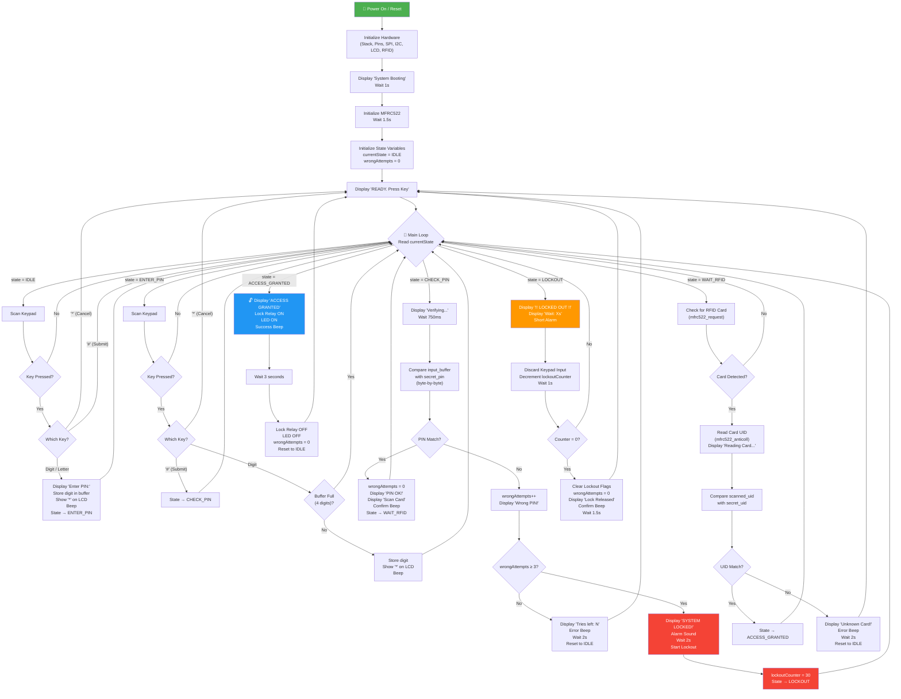

# EE322-RFID — Two-Factor Authentication Lock (AVR Assembly)

> **Course:** EE 322 – Embedded Systems | **Platform:** Arduino Uno (ATmega328P) | **Language:** AVR Assembly (GNU AS `.S`)

---

## Table of Contents

1. [Project Overview](#project-overview)
2. [Hardware Requirements](#hardware-requirements)
3. [Pin Mapping](#pin-mapping)
4. [Software Architecture](#software-architecture)
5. [Detailed Code Explanation — `TwoFactorLock_Full.S`](#detailed-code-explanation--twofactorlock_fulls)
   - [Preprocessor & Constants (Lines 1–93)](#1-preprocessor--constants-lines-193)
   - [Data Section (Lines 94–178)](#2-data-section-lines-94178)
   - [Interrupt Vector Table (Lines 180–218)](#3-interrupt-vector-table-lines-180218)
   - [RESET / Setup (Lines 220–343)](#4-reset--setup-lines-220343)
   - [Main Loop & State Machine (Lines 345–383)](#5-main-loop--state-machine-lines-345383)
   - [State: SYS_IDLE (Lines 385–461)](#6-state-sys_idle-lines-385461)
   - [State: SYS_ENTER_PIN (Lines 463–531)](#7-state-sys_enter_pin-lines-463531)
   - [State: SYS_CHECK_PIN (Lines 533–683)](#8-state-sys_check_pin-lines-533683)
   - [State: SYS_WAIT_RFID (Lines 685–764)](#9-state-sys_wait_rfid-lines-685764)
   - [State: SYS_ACCESS_GRANTED (Lines 766–806)](#10-state-sys_access_granted-lines-766806)
   - [State: SYS_LOCKOUT (Lines 808–888)](#11-state-sys_lockout-lines-808888)
   - [Helper: start_lockout (Lines 890–907)](#12-helper-start_lockout-lines-890907)
   - [Helper: reset_system (Lines 909–973)](#13-helper-reset_system-lines-909973)
   - [Keypad Scanner (Lines 975–1111)](#14-keypad-scanner-lines-9751111)
   - [I2C (TWI) Driver (Lines 1113–1154)](#15-i2c-twi-driver-lines-11131154)
   - [LCD I2C Driver (Lines 1156–1361)](#16-lcd-i2c-driver-lines-11561361)
   - [SPI Driver (Lines 1363–1401)](#17-spi-driver-lines-13631401)
   - [MFRC522 RFID Driver (Lines 1403–1625)](#18-mfrc522-rfid-driver-lines-14031625)
   - [Buzzer Functions (Lines 1627–1674)](#19-buzzer-functions-lines-16271674)
   - [Delay Functions (Lines 1676–1733)](#20-delay-functions-lines-16761733)
6. [System Flowchart](#system-flowchart)
7. [Repository Structure](#repository-structure)
8. [How to Build & Flash](#how-to-build--flash)

---

## Project Overview

This project implements a **two-factor authentication door-lock system** entirely in **bare-metal AVR assembly** (`.S` file, GNU assembler syntax). The two factors are:

1. **PIN Entry** — User types a 4-digit PIN on a 4×4 matrix keypad.
2. **RFID Card Scan** — User presents an RFID card/tag to the MFRC522 reader.

Only when **both** factors match the stored credentials does the system unlock. After **3 consecutive wrong PIN attempts**, the system enters a **30-second lockout** period during which all input is ignored.

---

## Hardware Requirements

| Component | Description |
|---|---|
| **Arduino Uno** | ATmega328P @ 16 MHz |
| **4×4 Matrix Keypad** | 8-pin membrane keypad |
| **I2C LCD 16×2** | HD44780 LCD with PCF8574 I2C backpack (address `0x27`) |
| **MFRC522 RFID Module** | 13.56 MHz RFID reader (SPI interface) |
| **Buzzer** | Active/passive buzzer for audio feedback |
| **Relay / Solenoid Lock** | Electronic lock or relay module for the door |
| **LED** | Status indicator LED |

---

## Pin Mapping

| Function | Arduino Pin | AVR Port/Pin |
|---|---|---|
| Buzzer | D8 | PB0 |
| Lock (Relay) | D7 | PD7 |
| Status LED | A3 | PC3 |
| RFID SS (Chip Select) | D10 | PB2 |
| RFID RST | D9 | PB1 |
| RFID MOSI | D11 | PB3 |
| RFID MISO | D12 | PB4 |
| RFID SCK | D13 | PB5 |
| LCD SDA | A4 | PC4 |
| LCD SCL | A5 | PC5 |
| Keypad Row 1–4 | D2–D5 | PD2–PD5 |
| Keypad Col 1 | D6 | PD6 |
| Keypad Col 2–4 | A0–A2 | PC0–PC2 |

---

## Software Architecture

The firmware follows a **finite state machine (FSM)** with 6 states:

| State Value | Name | Description |
|---|---|---|
| 0 | `SYS_IDLE` | Waiting for any key press |
| 1 | `SYS_ENTER_PIN` | User is entering digits |
| 2 | `SYS_CHECK_PIN` | Comparing entered PIN with stored secret |
| 3 | `SYS_WAIT_RFID` | PIN matched; waiting for RFID card |
| 4 | `SYS_ACCESS_GRANTED` | Both factors matched; unlock for 3 s |
| 5 | `SYS_LOCKOUT` | 3 wrong attempts; 30-second countdown |

---
S

## System Flowchart



---

## Repository Structure

```
EE322-RFID/
├── README.md                          ← You are here
├── arduino/
│   ├── TwoFactorLock/
│   │   ├── TwoFactorLock.ino          ← Original Arduino C++ sketch
│   │   ├── TwoFactorLock_Full.S       ← Full AVR assembly translation (1738 lines)
│   │   ├── TwoFactorLock_Hybrid.ino   ← Hybrid C++/assembly version
│   │   ├── asm_implementation.S       ← Standalone assembly helper routines
│   │   ├── AssemblerApplication1/     ← Atmel Studio project files
│   │   ├── docs/                      ← Additional documentation
│   │   └── src/                       ← Additional source files
│   └── SmartDoorLock/                 ← Alternative lock implementation
└── asm_sim/                           ← Assembly simulation/testing
```

---

## How to Build & Flash

### Option 1: Arduino IDE

1. Open `TwoFactorLock.ino` (or the hybrid `.ino`) in Arduino IDE.
2. Place `TwoFactorLock_Full.S` in the same sketch folder.
3. Select **Board → Arduino Uno** and the correct **Port**.
4. Click **Upload**.

### Option 2: Command-Line (avr-gcc + avrdude)

```bash
# Assemble
avr-gcc -mmcu=atmega328p -nostdlib -o TwoFactorLock.elf TwoFactorLock_Full.S

# Convert to hex
avr-objcopy -O ihex TwoFactorLock.elf TwoFactorLock.hex

# Flash (adjust -P port as needed)
avrdude -c arduino -p m328p -P COM3 -b 115200 -U flash:w:TwoFactorLock.hex:i
```

---

> **Credentials stored in the code:**
> - **PIN:** `1234`
> - **RFID UID:** `67:93:A9:04`
>
> Change `secret_pin` and `secret_uid` in the `.data` section to use your own credentials.
